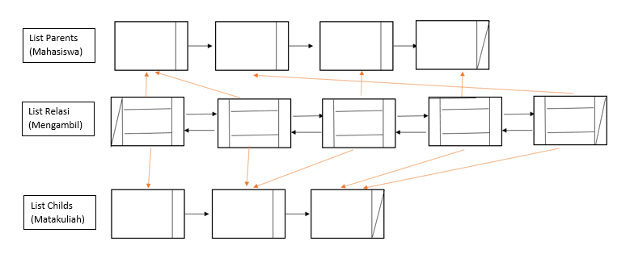
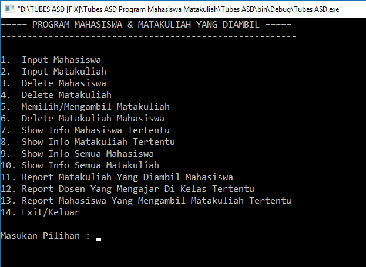

# Aplikasi Mahasiswa Mengambil Matakuliah

:one: Tentang
-------------
* Nama Aplikasi : Aplikasi Mahasiswa Mengambil Matakuliah
* Mata Kuliah : Struktur Data (STD)
* Bahasa Pemrograman : C++
* Software : CodeBlock
* Platform : Desktop
* Kontribusi Saya : Menyeluruh

:two: Deskripsi
---------------
Aplikasi ini digunakan mahasiswa untuk mengambil mata kuliah. Mata kuliah yang tersedia sebelumnya telah diinputkan user (admin), kemudian mahasiswa dapat memilih/mengambil mata kuliah yang tersedia. Selanjutnya mahasiswa dapat menampilkan seluruh informasi terkait mahasiswa dengan matakuliah yang diambil, termasuk dengan nama dosen yang mengajar, informasi kelas, dan lain sebagainya. Selain itu pula, mahasiswa dapat menghapus mata kuliah yang selesai diambil sesuai dengan kebutuhan, atau menghapus data diri mahasiswa tersebut. 

:three: Fitur
-------------
- [x] **Insert Mahasiswa** : Fitur ini dapat menginputkan data diri yang berisi nama, nim dan kelas. Data mahasiswa baru akan diletakan di akhir list parents.

- [x] **Insert Matakuliah** : Fitur ini dapat menginputkan data matakuliah yang berisi nama matakuliah, kode matakuliah dan nama dosen yang mengajar. Data matakuliah baru akan cek terlebih dahulu kemudian diurutkan berdasarkan nama matakuliah tersebut dan kemudian diletakan.

- [x] **Delete Mahasiswa** : Fitur ini dapat menghapus data mahasiswa tertentu, dan secara tidak langsung menghapus hubungan dengan matakuliah yang sedang diambil.

- [x] **Delete Matakuliah** : Fitur ini dapat menghapus data matakuliah tertentu, dan secara tidak langsung menghapus hubungan dengan mahasiswa yang mengambil matakuliah tersebut.

- [x] **Mengambil/Memilih Matakuliah** : Fitur Ini dapat menghubungkan mahasiswa tertentu dengan matakuliah yang akan diambil.

- [x] **Menghapus Matakuliah Tertentu** : Fitur ini dapat menghapus hubungan mahasiswa dengan matakuliah tertentu.

- [x] **Show Mahasiswa Tertentu** : Fitur ini dapat menampilkan data mahasiswa tertentu.

- [x] **Show Matakuliah Tertentu** : Fitur ini dapat menampilkan data matakuliah tertentu.

- [x] **Show Semua Mahasiswa** : Fitur ini dapat menampilkan data mahasiswa secara keseluruhan yang sebelumnya telah diinputkan.

- [x] **Show Semua Matakuliah** : Fitur ini dapat menampilkan data matkuliah secara keseluruhan yang sebelumnya telah diinputkan.

- [x] **Report Matakuliah yang diambil Mahasiswa** : Fitur ini dapat menampilkan matakuliah-matakuliah yang sedang diambil mahasiswa tertentu.

- [x] **Report Dosen yang mengajar di kelas tertentu** : Fitur ini dapat menampilkan data nama-nama dosen yang mengajar dikelas tertentu.

- [x] **Report Mahasiswa yang mengambil Matakuliah tertentu** : Fitur ini dapat menampilkan nama-nama mahasiswa yang sedang mengambil matakuliah tertentu.

:four: Struktur Data
--------------------

:five: Screenshoot
------------------

